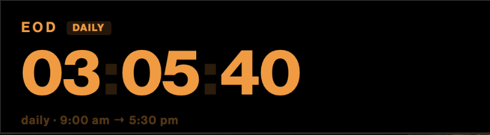

# Countdown

A minimal, always-on-top macOS countdown widget styled like a Bloomberg Terminal — big monospaced digits in terminal orange on black. It floats above other windows, joins all Spaces, and remembers exactly where you put it.



Two countdown modes:

- **Daily** — counts down to a target time each day (e.g. end of day, `9:00 am → 5:30 pm`), then waits for the next reset.
- **Fixed date** — counts down to a specific date/time.

## Features

- Borderless floating window, movable by dragging anywhere on its background.
- **Pinned position & size** — the widget reopens at the exact spot and size you left it, with no launch-time drift.
- HUD (compact) and full layouts; hover to reveal add / resize / settings / quit controls.
- Multiple countdowns, custom labels, and terminal color themes (orange, amber, cyan, green, red, white).
- Optional menu-bar item and launch-at-login.

## Build

Requires macOS 13+ and a Swift toolchain (Xcode or the Swift command-line tools).

```sh
./build-app.sh
open Countdown.app          # run in place
# or install it:
mv Countdown.app ~/Applications/
```

## Fonts

The widget is designed for **Neue Haas Grotesk Display**, a commercial typeface that is **not included** in this repository for licensing reasons. The app runs fine without it — SwiftUI falls back to the system font.

To match the intended look, drop your licensed font files into `Resources/Fonts/` before building:

```
Resources/Fonts/NHGDisplay-Regular.ttf
Resources/Fonts/NHGDisplay-Medium.ttf
Resources/Fonts/NHGDisplay-Bold.ttf
```

(Or edit the PostScript names in `Sources/Countdown/Models.swift` to point at any font you prefer.)

## License

MIT — see [LICENSE](LICENSE). Note that the MIT license applies to this source code only, **not** to any fonts you supply.
